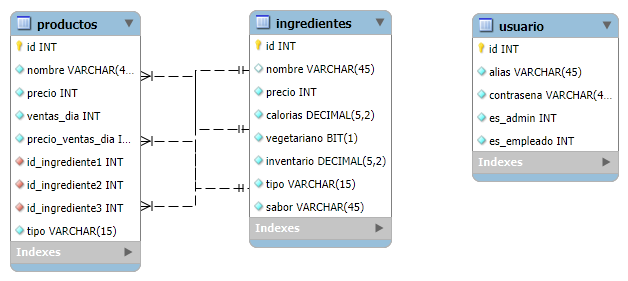

# Heladeria - Proyecto 4 (Final)

En este repositorio encontrará el código fuente y recursos necesarios para ejecutar el proyecto # 4 del curso de Backend de Python.

### Archivos importantes:
* `ProyectoFinal.postman_collection.json`: Colección de postman
* `requirements.txt`: Archivo con la lista de componentes usados en la solución
* `/SQL-Resources/backup/heladeria.sql`: Script backup de base de datos con el DDL y el DML
* `Api-Capturas.docx`: Documento con las capturas

> [!IMPORTANT]  
> Url ralway: https://proyecto4egordillo-production.up.railway.app/.

> [!IMPORTANT]  
> Url API ralway: https://proyecto4egordillo-production.up.railway.app/api.

## Base de datos
### Usuarios de base de datos
| Usuario  | Contraseña  | Admin  | Empleado  |
|:-:|:-:|:-:|---|
| admin  | 123  | True  | False  |
| administrator | 234  | True  | False  |
|  client1  | 345  | False  | False  |
|  user2  | 456  | False  | True  |

### Diagrama

